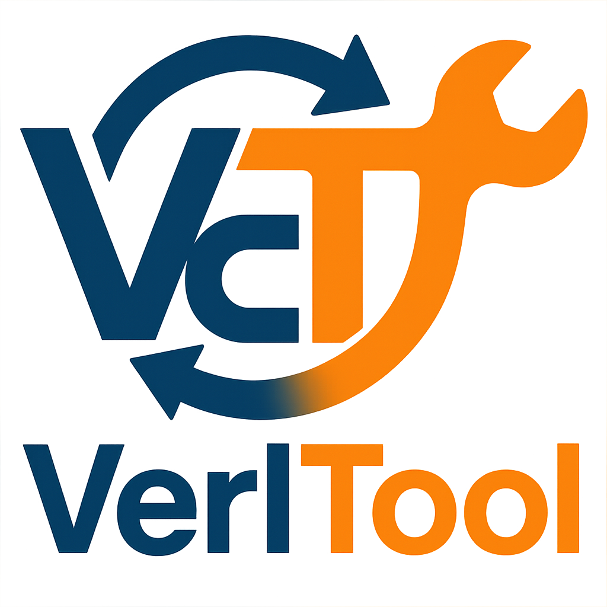

# Verl-Tool

<p align="center">
  <picture>
    <source media="(prefers-color-scheme: dark)" srcset="assets/imgs/logo.png">
    
  </picture>
</p>

<h3 align="center">
VerlTool: A unified and easy-to-extend tool-agent training framework based on verl.
</h3>

<p align="center">
| 
<a href="https://arxiv.org/abs/2509.01055"><b>Paper</b></a> |
<a href="https://github.com/TIGER-AI-Lab/verl-tool/blob/main/assets/docs/install.md"><b>Quick Start</b></a> |
  <a href="https://github.com/TIGER-AI-Lab/verl-tool/tree/main/examples/train"><b>Training Recipes</b></a> |
  <a href="https://deepwiki.com/TIGER-AI-Lab/verl-tool"><b>DeepWiki</b></a> |
  <a href="https://github.com/TIGER-AI-Lab/verl-tool/tree/main/assets/imgs/wechat_group.jpg"><b>WeChat Group</b></a> |
  <a href="https://discord.gg/CUARJFJ8"><b>Discord</b></a>
|
</p>

---


## News
+ [2025/09/02] VerlTool's tech report is out! See on [Hugging Face Daily Paper](https://huggingface.co/papers/2509.01055)!
+ [2025/06/30] We reproduce Search-R1 with even higher performance on the same benchmarks! See [PR](https://github.com/TIGER-AI-Lab/verl-tool/pull/71) and training [README](examples/train/search_r1/README.md) for more details.
+ [2025/06/28] We support NL2SQL tool RL training. See NL2SQL [README](examples/train/nl2sql/README.md) for more details.
+ [2025/06/26] We support DAPO recipe training. See [DAPO.md](./assets/docs/DAPO.md) for more details.
+ [2025/06/18] VerlTool now officially supports Trajectory-Level asynchronous, speeding up the rollout generation with tool calling by at least 2x! see [asyncRL.md](./assets/docs/asyncRL.md) for more details.
+ [2025/06/16] We have updated the verl submodule to the latest version (06/16) and modified some code to adapt to the new version.
+ [2025/06/13] We integrated [DeepWiki](https://deepwiki.com/TIGER-AI-Lab/verl-tool) for Verl-Tool. Feel free to browse the AI-generated docs and chat with Verl-tool codes.
+ [2025/06/06] We have updated a detailed design overview in the README, including how to add new tools, how to use the tool server, and how to train your own models with verl-tool.
+ [2025/05/31] We released the Verl-tool training/evaluation code with ToRL training as an initial example (see [X post](https://x.com/DongfuJiang/status/1929198238017720379)). We are working on the paper and will release it very soon.

## Features

- 🔧 **Complete decoupling of actor rollout and environment interaction** - We use verl as a submodule to benefit from ongoing verl repository updates. All tool calling is integrated via a unified API, allowing you to easily add new tools by simply adding a Python file and testing independently.
- 🌍 **Tool-as-environment paradigm** - Each tool interaction can modify the environment state. We store and reload environment states for each trajectory.
- ⚡ **Native RL framework for tool-calling agents** - verl-tool natively supports multi-turn interactive loops between agents and their tool environments.
- 📊 **User-friendly evaluation suite** - Launch your trained model with OpenAI API alongside the tool server. Simply send questions and get final outputs with all interactions handled internally. See [benchmarks](benchmarks).


## 📚 Contents Link
- 📖 [Installation Guide](./assets/docs/install.md)
- ⚡ [Synchronous Rollout Design](./assets/docs/sync_design.md)
- 🔄 [Asynchronous Rollout Design](./assets/docs/asyncRL.md)
- 🛠️ [Tool Server Design](./assets/docs/tool_server.md)
- 🎯 [Training Guide](./assets/docs/training_guide.md)
- 📊 [Evaluation Guide](./assets/docs/evaluation.md)
- 🔧 [Update Verl Submodule Version](./assets/docs/update_verl.md)
- 📈 [Existing Training Results](./assets/docs/math_results.md)
- 🤝 [Contributing Guide](./assets/docs/contributing.md)

## Core Contributors

<table>
<tr>
    <td align="center">
        <a href="https://github.com/jdf-prog">
            
            <br />
            <sub><b>Dongfu Jiang</b></sub>
        </a>
    </td>
    <td align="center">
        <a href="https://github.com/Zhuofeng-Li">
            
            <br />
            <sub><b>Zhuofeng Li</b></sub>
        </a>
    </td>
    <td align="center">
        <a href="https://github.com/EigenTom">
            
            <br />
            <sub><b>Yi Lu</b></sub>
        </a>
    </td>
    <td align="center">
        <a href="https://github.com/cogito233">
            
            <br />
            <sub><b>Zhiheng Lvu</b></sub>
        </a>
    </td>
    <td align="center">
        <a href="https://github.com/erenup">
            
            <br />
            <sub><b>Ping Nie</b></sub>
        </a>
    </td>
</tr>
</table>

## Advisors

<table>
<tr>
    <td align="center">
        <a href="https://github.com/wenhuchen">
            
            <br />
            <sub><b>Wenhu Chen</b></sub>
        </a>
    </td>
    <td align="center">
        <a href="https://github.com/P2333">
            
            <br />
            <sub><b>Tianyu Pang</b></sub>
        </a>
    </td>
    <td align="center">
        <a href="https://github.com/duchao0726">
            
            <br />
            <sub><b>Chao Du</b></sub>
        </a>
    </td>
</tr>
</table>

## Acknowledgements

We thank the following open-source projects for making verl-tool possible:
- [VLLM](https://github.com/vllm-project/vllm) and [SGLang](https://github.com/sgl-project/sglang) for their fast LLM inference support!
- [verl](https://github.com/volcengine/verl) for the excellent RL framework design.
- [SearchR1](https://github.com/PeterGriffinJin/Search-R1), [RAGEN](https://github.com/RAGEN-AI/RAGEN), and [ToRL](https://github.com/GAIR-NLP/ToRL) for their early-stage exploration of tool-agent RL training.

We thank [Netmind.AI](https://www.netmind.ai/), [SeaAI Lab](https://sail.sea.com/), and [Map](https://huggingface.co/m-a-p) for GPU support!

## Star History

[](https://www.star-history.com/#TIGER-AI-Lab/verl-tool&Date)


## Badge

[](https://mseep.ai/app/tiger-ai-lab-verl-tool)

## Citation
```bibtex
@article{jiang2025verltool,
  title={VerlTool: Towards Holistic Agentic Reinforcement Learning with Tool Use},
  author={Jiang, Dongfu and Lu, Yi and Li, Zhuofeng and Lyu, Zhiheng and Nie, Ping and Wang, Haozhe and Su, Alex and Chen, Hui and Zou, Kai and Du, Chao and others},
  journal={arXiv preprint arXiv:2509.01055},
  year={2025}
}
```
